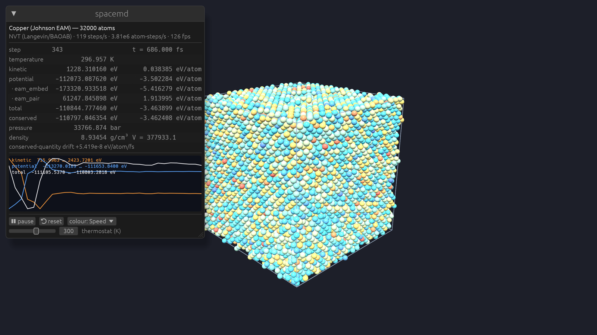

# Space3d-Molecular

Molecular dynamics and electron-emission physics from SpaceCorps, built on the
[Space3d](https://github.com/SpaceCorps) engine: how atoms interact, what energies they carry,
and how electrons leave hot, field-loaded surfaces, computed fast and watched live.



This repository holds the **public interface**: install instructions, API reference, input
formats, report formats and runnable client examples. The engines are distributed as Rust crates
and prebuilt binaries from the SpaceCorps package registry (see [Install](#install)); their source
is not in this repository.

| component | what it does | docs |
|---|---|---|
| **spacemd** | molecular dynamics engine: crystals, liquids, ionic solids, metals, water; full energy and thermodynamic reports | [input format](docs/md-input.md) · [reports](docs/md-reports.md) · [examples](examples/md) |
| **spaceemit** | thermal-field electron emission as an HTTP/JSON API: current density, Nottingham heat, energy spectra, barrier, transmission, I–V fitting | [API reference](docs/emission-api.md) · [OpenAPI](docs/openapi.yaml) · [client examples](examples/emission) |
| **molviewer** | live 3-D view of a running simulation (Space3d, GPU-instanced), with an energy panel and thermostat control | [screenshots](assets) |

## Install

Registry: <https://spacecorps-registry.sliplane.app>. No account or token is needed.

**Rust libraries.** Add the registry to `~/.cargo/config.toml` once:

```toml
[registries.spacecorps]
index = "sparse+https://spacecorps-registry.sliplane.app/index/"
```

```sh
cargo add spacemd --registry spacecorps     # molecular dynamics engine
cargo add spaceemit --registry spacecorps   # electron emission library
```

**Command-line tools**, from source or prebuilt:

```sh
cargo install spacemd-cli --registry spacecorps        # → spacemd
cargo install spaceemit-server --registry spacecorps   # → spaceemit (HTTP API + CLI)
```

Prebuilt binaries for macOS (`aarch64-apple-darwin`, `x86_64-apple-darwin`) and Linux (static:
`x86_64-unknown-linux-musl`, `aarch64-unknown-linux-musl`):

```sh
curl -fsSLO https://spacecorps-registry.sliplane.app/bin/spacemd/latest/spacemd-0.1.0-aarch64-apple-darwin.tar.gz
tar xzf spacemd-0.1.0-aarch64-apple-darwin.tar.gz
curl -s https://spacecorps-registry.sliplane.app/bin/spacemd     # versions, files, sha256
```

x86_64 binaries need AVX2 (Intel Haswell / AMD Excavator, 2013 or newer). Replace `spacemd` with
`spaceemit` for the emission service. Start the API with `spaceemit` (port 8741) or
`spaceemit --port 9000 --threads 8`.

## Electron emission API in 30 seconds

Try it against the public instance at **https://spaceemit-api.sliplane.app** (free, rate-limited; details in the
[API reference](docs/emission-api.md#hosted-instance)):

```sh
curl -s https://spaceemit-api.sliplane.app/v1/emission -H 'content-type: application/json' -d '{
  "field": [3, 5, 8], "radius": 50, "workFunction": 4.5, "temperature": [300, 1000, 2000]
}'
```

```json
{"count": 3,
 "currentDensity": [1.980e-13, 3.605e-09, 9.853e-07],
 "nottinghamHeat": [-2.154e-14, -3.182e-10, -5.009e-08],
 "meanEnergy": [-0.109, -0.088, -0.051],
 "barrierTop": [2.432, 1.828, 1.117],
 "regime": ["field", "field", "field"], "errors": [], "elapsedMs": 0.84}
```

Units: field V/nm, radius nm, energies eV, current density A/nm², Nottingham heat W/nm²
(negative = the emitter is heated). Every numeric input can be a number or an array. Clients:
[curl](examples/emission/curl.sh) · [Python](examples/emission/python/emission.py) ·
[TypeScript](examples/emission/typescript/emission.ts) · [Rust](examples/emission/rust/src/main.rs).

**Capabilities**

- Metals and semiconductors: finite band depth and effective mass.
- Curved emitters: local radius of curvature and field-decay shape.
- Every emission regime: field, intermediate and thermionic.
- Total, normal and parallel energy distributions.
- Fast semiclassical mode for large scans.
- I–V curve fitting, with uncertainties, for field conversion factor, emission area, radius,
  work function and temperature.

## Molecular dynamics in 30 seconds

```sh
spacemd example argon > argon.json   # liquid argon, 2 048 atoms
spacemd run argon.json               # → thermo.csv, report.json, summary.md, g(r), MSD, VACF, trajectory
```

**Capabilities**

- **Potentials:** Lennard-Jones, Morse, Buckingham, Coulomb (damped shifted force and Ewald),
  embedded-atom method (LAMMPS `setfl`/`funcfl` files), harmonic bonds and angles, external
  (oscillating) electric fields.
- **Ensembles:** NVE, NVT (Langevin, Nosé–Hoover chains, Berendsen), NPT (Berendsen), energy
  minimization with cell relaxation.
- **Cells:** periodic orthorhombic and triclinic, or open boundaries.
- **Reports:**
  - every energy term separately;
  - full pressure tensor;
  - block-averaged error bars;
  - conserved-quantity drift;
  - heat capacity;
  - radial distribution function, diffusion from MSD and VACF.

Sample output: [`examples/md/sample-output/summary.md`](examples/md/sample-output/summary.md).

## Performance (Apple M4 Max, 16 threads)

| workload | throughput |
|---|---|
| Lennard-Jones liquid (LAMMPS `in.lj` benchmark system), 32k / 256k / 1M atoms | 40 M / 67 M / 74 M atom-steps/s (up to 108 M with mixed precision) |
| Electron emission, one point (exact transmission, J + Nottingham heat) | 14 µs |
| Electron emission, 10⁶ points | 1.65 s |

## Validation

| check | result |
|---|---|
| Lennard-Jones equation of state, T* = 2.0, ρ* = 0.8 | P* = 5.286 ± 0.021 (Johnson et al. 1993: 5.312) |
| NaCl Madelung constant (Ewald) | 1.74756459 (exact 1.747565) |
| Liquid argon self-diffusion at 94.4 K | 2.43–2.55 × 10⁻⁵ cm²/s (Rahman 1964: 2.43 × 10⁻⁵) |
| Forces vs. energy gradients, every potential | relative error ≤ 4 × 10⁻⁸ |
| NVE energy conservation, 10k steps | drift 9 × 10⁻⁸ ε/atom/τ |
| Thermostat temperature and kinetic-energy fluctuations | within statistical error |
| Emission: Murphy–Good, Richardson–Schottky, Nottingham inversion, planar limit | reproduced |
| Emission: numerical convergence | ~10⁻⁶ relative |
| Emission: spectra sum rules | ∫TED = ∫NED = ∫PED = J to ≤ 5 × 10⁻⁴ |

## Support

Please report documentation issues and API questions in this repository's issue tracker.

## License

- **spacemd and spaceemit** (crates and binaries from the registry): [PolyForm Shield License
  1.0.0](https://polyformproject.org/licenses/shield/1.0.0/). You may use them for any purpose,
  commercial included: build on them, embed them, ship products with them. You may not use them to
  provide a product that competes with them or with SpaceCorps products built on them.
- **Documentation and examples in this repository:** MIT (see [LICENSE](LICENSE)).
- **molviewer** and the Space3d engine are proprietary and not distributed.
