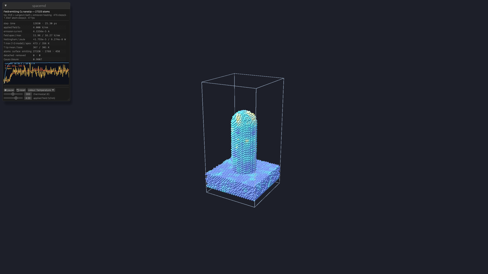

# spacetip — a field-emitting nanotip heated by its own emission

`spacetip` couples the two engines into one simulation. It models a metal nanotip on a substrate
under a strong applied electric field. The atoms move by molecular dynamics (spacemd, EAM metal).
An electrostatic solve gives the local field at every surface atom, and spaceemit turns that
field into emission current and Nottingham heat per atom. That heat goes back into the atoms,
together with resistive (Joule) heating and heat conduction to the substrate. You watch the
current rise, the apex heat up, and, in the thermionic regime, Nottingham cooling take over.



## Run it

```sh
spacemd example tip > tip.json               # 27k-atom Cu [001] tip, 4 V/nm (~15 s on 16 cores)
spacemd tip tip.json -o tip-out              # series.csv/json, summary.md, extxyz snapshots
spacemd example tip_thermionic > hot.json    # hot, low-work-function tip: Nottingham cooling
```

From Rust (`cargo add spacetip spacemd --registry spacecorps`):

```rust
use spacemd::prelude::{Eam, EamTables, ForceField};
use spacetip::{TipConfig, TipGeometry, TipSimulation};

let geometry: TipGeometry = serde_json::from_str(r#"{"box_xy": [50, 50], "substrate_thickness": 16,
    "tip_radius": 12, "tip_height": 45}"#)?;
let mut cfg = TipConfig::default();
cfg.field.applied_field = 5.0;                                    // V/nm
let ff = ForceField::new().with(Eam::new(EamTables::johnson_cu(), vec![0]));
let mut tip = TipSimulation::new(cfg, &geometry, ff, "Cu", 63.546, 3.615)?;
tip.equilibrate(300);
tip.reset_ledger();
tip.advance(1000);                                                // MD steps
let last = tip.series.last().unwrap();
println!("{} A, apex {} V/nm, {} K", last.current, last.field_apex, last.t_model_max);
```

## Model

- **Geometry.** A hemisphere-capped cylinder on a laterally periodic slab, fcc or bcc, with the
  tip axis along [001], [110] or [111]. The bottom layers are fixed; the layers above them are a
  heat bath at the set temperature.
- **Field.** The electrostatic potential around the tip is solved with the atoms as a grounded
  conductor, under a uniform applied field E₀ far above. Every exposed surface atom gets its
  local field, local radius of curvature and emitting area. The Maxwell stress ε₀F²/2 pulls on
  the surface.
- **Emission.** spaceemit gives each surface atom its current density and Nottingham heat, from
  the local field, radius, work function, band depth and local temperature.
- **Heat.** Nottingham heat, Joule heat (1-D current model with a temperature-dependent
  resistivity) and electronic heat conduction to the substrate are deposited into the atoms.
  Energy and momentum are conserved.
- **Heating acceleration.** Real emission heating is slow on MD time scales, so an explicit
  acceleration factor multiplies every heat flow. Steady-state temperatures don't depend on it.
- **Field reuse.** The field is recomputed every N MD steps, and reused while the atoms have
  barely moved.

## Input

```jsonc
{
  "title": "Cu tip", "seed": 7,
  "potential": { "builtin": "johnson_cu" },        // or {"setfl": "Cu.eam.alloy", "element": "Cu"} / {"funcfl": ...}
  "geometry": { "crystal": "fcc", "lattice_constant": 3.615, "orientation": "001",   // "110", "111"
                "box_xy": [90, 90], "substrate_thickness": 25, "tip_radius": 20, "tip_height": 100,
                "fixed_thickness": 3, "bath_thickness": 6 },                     // lengths in Å
  "md": { "dt": 2.0, "steps": 10000, "temperature": 300, "bath_damping": 100,
          "equilibration_steps": 1000, "skin": 0.5 },                           // fs, K
  "coupling": { "every": 50, "deliver_every": 5, "sample_every": 1 },
  "field": { "mode": "laplace",                    // or "prescribed" with "prescribed_field" (V/nm)
             "applied_field": 4.0, "ramp_steps": 3000, "grid_spacing": 1.5,   // V/nm, steps, Å
             "maxwell_stress": true, "reuse_rmsd": 0.3, "reuse_max_updates": 4 },
  "emission": { "work_function": 4.5, "band_depth": 7.0, "min_field": 3.0, "mode": "exact" },
  "heat": { "transport": "electronic", "acceleration": 1.0, "nottingham": true, "joule": true,
            "resistivity": { "model": "copper" }, "size_factor": 3.0, "lorenz": 2.0e-8 },
  "evaporation": { "remove_height": 15.0, "remove": true },
  "output": { "dir": null, "snapshot_every": 2500, "print_every": 1000, "final_xyz": true }
}
```

- Keys that are left out, or set to `null`, take sensible defaults. Unknown keys are rejected.
- Resistivity models:
  - `copper`
  - `copper_solid`
  - `{"model": "table", "points": [[T, ρ], …]}`
  - `{"model": "linear", "rho_ref", "t_ref", "alpha"}`
- The full examples are [`examples/md/tip.json`](../examples/md/tip.json) and
  [`examples/md/tip_thermionic.json`](../examples/md/tip_thermionic.json).

## Output

- **`series.csv` / `series.json`**: one row per coupled update. The main columns:
  - total emission current (A);
  - apex and maximum surface field (V/nm);
  - Nottingham and Joule power (W);
  - tip temperatures: hottest slab, mean, apex and base (K);
  - atom counts, including detached and removed atoms;
  - energy-ledger columns.
- **`snapshots.extxyz` / `final.extxyz`**: per-atom field (V/nm), current density (A/nm²),
  Nottingham heat (W/nm²), temperature (K), area and current. They load straight into OVITO.
- **`summary.md` / `report.json`**: the system, the model settings, statistics of every series
  column, energy accounting and performance.

## Example run

The `tip` example: 27 320 atoms, E₀ ramped to 4 V/nm, 20 ps of production. It runs in about
13 s on an Apple M4 Max.

| t (ps) | E₀ (V/nm) | current (A) | apex / max field (V/nm) | Nottingham / Joule (W) | tip T, 1-D model (K) | tip mean (K) |
|---|---|---|---|---|---|---|
| 2 | 1.33 | 1.4e-12 | 4.0 / 5.1 | 1.3e-13 / 1e-22 | 300 | 299 |
| 6 | 4.00 | 4.3e-05 | 12.0 / 15.8 | 1.8e-05 / 9.0e-08 | 388 | 315 |
| 8 | 4.00 | 4.4e-05 | 12.1 / 15.5 | 1.8e-05 / 1.1e-07 | 453 | 353 |
| 22 | 4.00 | 4.3e-05 | 11.9 / 15.4 | 1.8e-05 / 1.1e-07 | 460 | 361 |

The apex reaches steady state (~460 K) within about 3 ps of full field. For this short, thick
tip Nottingham heating is about 200× the Joule heating.

## Validation

| check | result |
|---|---|
| Uniform field, flat surface | exact to 1 × 10⁻⁸ |
| Hemisphere on a plane: apex field enhancement | 2.966 (exact 3) |
| Flat atomistic Cu(100) surface | F/E₀ = 1.009 |
| Per-atom emission vs direct spaceemit | identical; sums equal totals to 10⁻¹² |
| Energy bookkeeping, heat only | scheduled = delivered; MD error 0.015 % |
| Field emission at high field | the apex heats (528 K vs 307 K at the base) |
| Thermionic conditions (1 V/nm, W = 2.5 eV, ~1000 K) | Nottingham cooling on every surface atom |

## Limitations

- **Field domain.** It is laterally periodic: an array of tips that screen each other. Use a
  larger box or `field.lateral_padding` for a more isolated tip.
- **Not modelled yet:** space charge, Coulomb forces between charged surface atoms, and
  field evaporation of ions.
- **1-D heat model.** It averages temperature across each slab of the tip.
- **Built-in copper potential.** The `johnson_cu` potential is a simple model for demos. For
  quantitative work, use a published `setfl` file.
